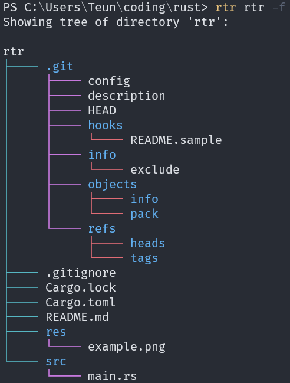

# `rtr` | Rust'ed `tree`

# Build

Build with cargo:

`$ cargo build [--release]`

# Usage

Usage is very simple:
```
USAGE:
    rtr.exe [FLAGS] [Path]

FLAGS:
    -f, --show-files    Show files inside folders.
    -a, --ascii         Use ASCII characters.
    -h, --help          Prints help information
    -V, --version       Prints version information
```

# Example

Showing a tree of all the files in this directory:

